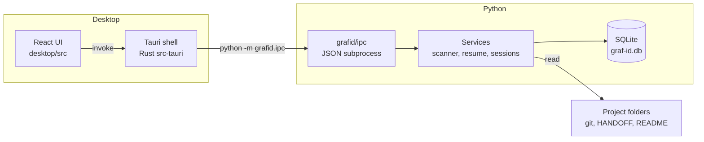
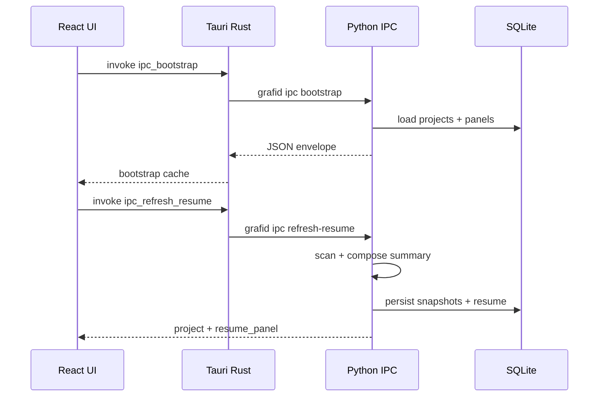
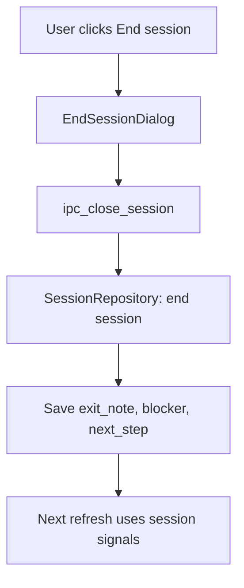

# Graph-Id architecture

Technical overview for developers resuming work on this codebase.

---

## System diagram



---

## Layers

### Frontend (`desktop/src/`)

- **React + TypeScript** — dashboard, sidebar, resume panel, settings, history
- **IPC client** (`desktop/src/ipc/client.ts`) — typed wrappers for Tauri commands
- **No direct SQLite access** — all data via Python IPC or bootstrap cache

Key components:

| Component | Role |
|-----------|------|
| `AppShell.tsx` | Navigation, project selection, refresh handler |
| `NavSidebar.tsx` | Project list picker |
| `ResumePanel.tsx` | Summary display, refresh context |
| `ProjectDetailHeader.tsx` | Project header + More details collapse |
| `ProjectActions.tsx` | Open project, folder, end session, history |

### Tauri (`desktop/src-tauri/`)

- Spawns **Python subprocess** per IPC command (or uses cached bootstrap data for reads)
- Resolves Python path: dev `.venv` vs packaged `runtime/python.exe`
- Sets `GRAFID_DATA_DIR`, `GRAFID_RESOURCE_ROOT`, `GRAFID_RUNTIME_MODE`

### Python core (`grafid/`)

| Area | Path | Role |
|------|------|------|
| CLI | `grafid/cli/` | Typer commands for terminal use |
| IPC | `grafid/ipc/` | JSON request/response handlers for desktop |
| Scanner | `grafid/scanner/` | Bounded filesystem walk, markers |
| Git | `grafid/git/` | Read-only git snapshots |
| Resume | `grafid/resume/` | Summary composition, workflow artifacts |
| DB | `grafid/db/` | SQLite repositories, schema v7 |
| Services | `grafid/services/` | Orchestration (startup, refresh, export) |

### SQLite

- **Location:** `%LOCALAPPDATA%\Graf-Id\graf-id.db` (override: `GRAFID_DATA_DIR`)
- **Stores:** projects, sessions, scan snapshots, git snapshots, resume rows, settings
- **Not** accessed by GrafiTalk directly — export files are the integration boundary

---

## IPC flow



### IPC entry

- Module: `grafid/ipc/desktop_entry.py`
- Pattern: `python -m grafid.ipc <subcommand>` (lightweight vs full CLI)
- Response: single JSON object `{ "ok": true, "data": ... }` on stdout

### Bootstrap optimization

On app load, `ipc_bootstrap` returns:

- All projects with `summary_preview` and cached `resume_panel`
- App settings
- Optional startup card

The UI reads from **in-memory cache** for project selection and settings — no Python spawn for navigation.

Python spawns for **work actions**: refresh, open project, end session, add/remove project.

---

## Project selection

1. User picks project in sidebar → `selectedId` in `AppShell`
2. Detail loaded from bootstrap cache or `ipc_project_detail`
3. `mergeDashboardProject` patches list state after refresh/actions

---

## Scanning

**Trigger:** Refresh context (`handle_refresh_resume`) or CLI `graf-id scan`

**Service:** `grafid/services/context_refresh.py` → `ProjectScannerService`

**Behavior:**

- Bounded walk with ignore rules (no full-drive scan)
- Allowlisted workflow files: HANDOFF, HANDOVER, README, NOTES, etc. (`workflow_artifacts.py`)
- Task markers (TODO/FIXME) extracted with quality filters
- Git snapshot via `GitReadService` if `git` on PATH
- Results persisted as scan + git snapshot rows

**No background watcher.** Scan runs only on explicit request.

---

## Summary generation

**Pipeline:**

```
load_workflow_artifacts(project_path)
  + session signals (exit note, blocker, next step)
  + git modified files
  + scan markers
    ↓
SummaryEngine.build_dashboard()
    ↓
compose_workflow_summary()  ← fixed priority order
    ↓
dashboard summary_text + resume_panel
```

**Priority (anchor / “where you left off”):**

1. Exit note  
2. Blocker  
3. Handoff artifact  
4. Workflow state from docs  
5. Session next step  
6. Project notes  
7. Scan markers  
8. Git modified files (only if no human doc signal)  
9. Generic active-session message  

**Code:** `grafid/resume/summary_composition.py`, `human_context.py`, `summary_engine.py`

---

## Resume flow

| Step | What happens |
|------|----------------|
| Select project | Show cached or fetched `resume_panel` |
| Refresh context | Scan → regenerate → update UI + DB |
| Open project | Start/resume session, update `last_opened_at`, launch IDE |
| End session | Exit note modal → `ipc_close_session` → fields feed next summary |

Stored resume (`resume_summaries` table) is separate from live dashboard summary; UI primarily shows **live composed** summary from `summary_engine`.

---

## Exit note flow



Exit notes are the **strongest** summary signal when present.

---

## Persistence

| Data | Location |
|------|----------|
| Config | `%LOCALAPPDATA%\Graf-Id\config.json` |
| Database | `%LOCALAPPDATA%\Graf-Id\graf-id.db` |
| Logs | `%LOCALAPPDATA%\Graf-Id\logs\` |
| Embedded runtime (packaged) | Next to app binary / `src-tauri/runtime/` |
| Build cache (dev) | `desktop/src-tauri/target/` (gitignored) |
| GrafiTalk export | `grafitalk/` inbox JSON files (optional) |

---

## Packaged runtime modes

| Mode | Python used |
|------|-------------|
| `development` | Repo `.venv\Scripts\python.exe` |
| `packaged` | `runtime/python.exe` bundled with installer |

Built by `packaging/build_runtime.ps1` — copies system Python stdlib + installs `grafid` into `Lib/site-packages`.

---

## Related docs

- [WORKFLOW.md](WORKFLOW.md) — user journey
- [PERFORMANCE_ARCHITECTURE.md](PERFORMANCE_ARCHITECTURE.md) — bootstrap cache rationale
- [desktop/README.md](../desktop/README.md) — IPC command list
